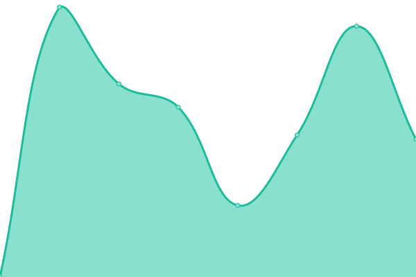

# [📈 Live Status](https://vvphuc.github.io/uptimestatus): <!--live status--> **🟧 Partial outage**

This repository contains the open-source uptime monitor and status page for [Vo Vy Phuc](https://vvphuc.github.io/uptimestatus), powered by [Upptime](https://github.com/upptime/upptime).

With [Upptime](https://upptime.js.org), you can get your own unlimited and free uptime monitor and status page, powered entirely by a GitHub repository. We use [Issues](https://github.com/vvphuc/uptimestatus/issues) as incident reports, [Actions](https://github.com/vvphuc/uptimestatus/actions) as uptime monitors, and [Pages](https://vvphuc.github.io/uptimestatus) for the status page.

<!--start: status pages-->
<!-- This summary is generated by Upptime (https://github.com/upptime/upptime) -->
<!-- Do not edit this manually, your changes will be overwritten -->
<!-- prettier-ignore -->
| URL | Status | History | Response Time | Uptime |
| --- | ------ | ------- | ------------- | ------ |
|  [Panel of Dau-gia](https://panel.phanmem.work) | 🟥 Down | [panel-of-dau-gia.yml](https://github.com/vvphuc/uptimestatus/commits/HEAD/history/panel-of-dau-gia.yml) | 

 0ms
     
 | 

<a href="https://vvphuc.github.io/uptimestatus/history/panel-of-dau-gia">0.00%</a>
    

|  [Dau-gia.com](http://dau-gia.com) | 🟥 Down | [dau-gia-com.yml](https://github.com/vvphuc/uptimestatus/commits/HEAD/history/dau-gia-com.yml) | 

 0ms
     
 | 

<a href="https://vvphuc.github.io/uptimestatus/history/dau-gia-com">0.00%</a>
    

|  [intecks.com](https://intecks.com) | 🟩 Up | [intecks-com.yml](https://github.com/vvphuc/uptimestatus/commits/HEAD/history/intecks-com.yml) | 

 4441ms
     
 | 

<a href="https://vvphuc.github.io/uptimestatus/history/intecks-com">100.00%</a>
    

|  [apcaustralia.net.au](https://apcaustralia.net.au) | 🟩 Up | [apcaustralia-net-au.yml](https://github.com/vvphuc/uptimestatus/commits/HEAD/history/apcaustralia-net-au.yml) | 

 458ms
     
 | 

<a href="https://vvphuc.github.io/uptimestatus/history/apcaustralia-net-au">100.00%</a>
    

<!--end: status pages-->

[**Visit our status website →**](https://vvphuc.github.io/uptimestatus)

## 📄 License

- Powered by: [Upptime](https://github.com/upptime/upptime)
- Code: [MIT](./LICENSE) © [Vo Vy Phuc](https://vvphuc.github.io/uptimestatus)
- Data in the `./history` directory: [Open Database License](https://opendatacommons.org/licenses/odbl/1-0/)
